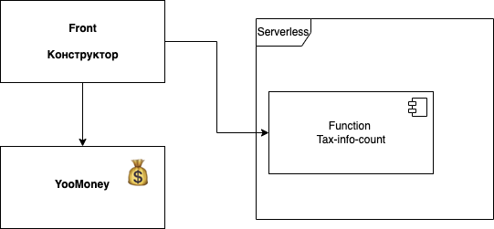
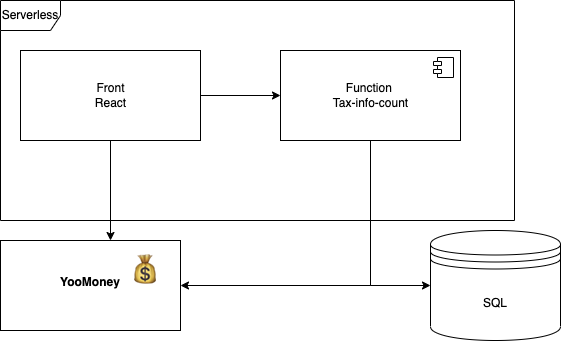

# Проект [налоговыйрезидент.рф](https://налоговыйрезидент.рф)

## Суть 
Трекер налогового резиденство. Помогает понять сколько дней ты еще должен находиться на территории РФ чтобы не потерять деньги. На зарубежном рынке есть аналогичные ресурсы: [flybird](https://www.taxbird.com/) и другие.

##  Заинтересанты

|Имя|Роль|Категория|Влияние|Интерес|Интересы|Частота контактов|
|---|----|---------|-------|-------|--------|-----------------|
|[Михаил Никитин](https://github.com/mikhailsnnt)|Директор|Внутрений|высокое|высокий|полное состояние проекта|Ежедневная|
|[Яндекс.Облако](https://cloud.yandex.ru)|Поставщик|Внешний|низкое|нет|Оплата|Нет|
|ФНС|Регулятор|Внешний|низкое|нет|Влияет на бизнес правила|Нет|
|[Юкасса](https://yookassa.ru)|Поставщик|Внешний|низкое|нет|Комиссия, законность|Нет|
|[LPGenerator](https://lpgenerator.ru)|Поставщик, на MVP|Внешний|низкое|нет|Оплата|Нет|

## Конкуренция

Flybird - для зарубежного рынка, с другими правилами расчета.

Косвенный конкурент - ручной расчет. 

## Экономический анализ.

Продукт актуален в виду большого оттока граждан из РФ, значительная часть которых [согласно РБК](https://t.me/rbc_news/65171), продолжает работать на компании на территории РФ.

## MVP 

В рамках MVP будет сделан калькулятор (вводишь даты своих отъездов, тебе выдает когда  у тебя есть опасность потерять резиденство). Cайт на конструкторе, оплата запроса с помощью YooKassa и затем запрос уходит на Serverless Yandex функцию.

## Предварительная архитектура первой версии после MVP

